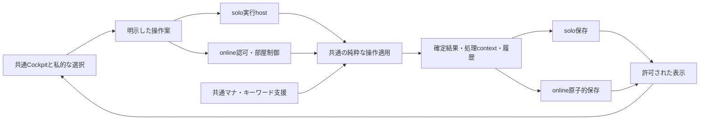

# 共通Cockpit：要求確定後のアーキテクチャ比較

日付: 2026-09-10。状態: コードを根拠とする比較と推奨。実証実装・方式の最終採用・公開は未実施。

Goal: [プロダクト要求](product-requirements.md)と[UX仕様§6](cockpit-ux-requirements-2026-09-09.md)のM-01〜11を、共通の操作体系と維持可能な基盤で実現する方式を選ぶ。
Non-goals: 全CR自動化、全既存自動効果の保全、今回の本体変更・データ移行・公開。方式比較のための第二UIを作らない。
Acceptance criteria: 四案を同じ成果・移行費・保守費で比較し、推奨、反証条件、移行先、最小実証、有限の完成条件を示す。
What stays untouched: HEAD `1f80a8dfbc89568f4a9d31459c655b3d54d5afe3` の既存tracked/untracked作業、保存データ、設定、公開環境。既存の型やファイル構成を設計上の制約にはしない。

ユーザーの依頼でUX実機試遊より先にこの比較を行う。五旅程の操作性はまだ未実証であり、画面配置の適否や完成度を本比較の根拠にしない。技術実証とUX試遊の両方を実装範囲の確定に使う。

## 1. 結論

**C：一人回しと対戦を、共通の卓上状態・操作適用へ段階的に統合する案を推奨する。** 既存一人回しとオンラインのいずれかを丸ごと正本として残す案ではなく、両者から必要な値・純粋処理・支援を取り出す。新しい正本の形はプレイヤー非依存とし、通常の手動操作を適用する実装は一つにする。

Cの採用条件として、一つの試合の確定主体は一つにする。共通コードを利用することは、同じonline操作をclient/serverで二重確定することではない。一人回しをローカルで確定する前提は§8の追加比較で再検討する。

理由は、一般効果の自動判断を縮小し、マナ・キーワード支援と手動操作を全モードで保全する、と要求が決まったため。以前の「一人回しの全自動化を温存し、オンラインだけ別の手動集約へ」というD案より、共通化の利益が大きくなり、移行時に保全する意味論の範囲が狭まった。

ただし、共通化に必要な抽出費は未測定。特にマナ解析とコマンド生成の分離、旧保存の損失なしの読込みはコード閲覧だけでは証明できない。§6の小さな実証により、Cの採用・局所的な再構築・Bへの変更を判断する。旧D案を名前だけCへ変更して採用したことにはしない。

## 2. 実装から確認した制約

| 根拠 | 現状 | 設計上の意味 |
| --- | --- | --- |
| [gameStore](../src/store/gameStore.ts) のresolveTop/dispatchTurnTransition/履歴 | 選択、手動解決、履歴、支援、進行がストアに接続されている | ストアから関数を呼ぶだけの共通化では、オンラインの権限と永続化を一体に扱えない |
| [commands](../src/engine/commands.ts) のmoveCardInternal/applyCommand | 移動内部で墓地行きを追放へ変更する経路があり、公開applyCommandは自動境界を伴う内部適用を呼ぶ | effectsAuto=falseだけを「手動適用」にしない。構造の更新と自動裁定を分離する必要がある |
| [autotap](../src/engine/autotap.ts) / [manaTransaction](../src/engine/manaTransaction.ts) | 純粋な計算資産はあるがGameState、現プレイヤーの別名フィールド、既存command/compilerに依存 | 解析全削除も、そのまま新stateへimportも成立しない。必要な入力と生成する操作を切り出す費用がある |
| [操作catalog](../src/components/game/actionCatalog.ts) / [ManualKeywordsDialog](../src/components/game/ManualKeywordsDialog.tsx) | キーワード付与、能力起動、未認識能力の手動入口がある | UI資産を再利用できる。支援後の確定先を共通適用へ替え、一般効果解決と切り離す |
| [online手動binding](../src/online/tabletopManual/server.ts) | actor、active player、priority、Core stack/lifecycleに結合 | 部屋主やmasterの外側チェックだけ変更しても、他席への代行が成立しない |
| [Core tabletop](../src/engine/core/tabletop/operationsV1.ts) | draw/tap/move等がrootを再構築し、strict lifecycleを伴う | 値の不変条件は有用だが、操作関数を丸ごと共通中核にはできない |
| [remote画面](../src/components/online/remoteGameScreen.tsx) のprojectionToGameState | 私的領域や履歴を空で埋め、solo GameStateへ投影を合わせる | 不明/非公開と空を区別する表示契約へ替える。投影からゲーム状態を復元しない |
| [variable protocol](../src/online/protocol/variable.ts) / [persistence](../src/online/cloudflare/persistence.ts) | revisionがCore acceptedCommandCountに結合。状態JSONとreceipt配列を含む全体を検査/保存する経路 | 制御・取消・期限の変更を旧Coreコマンド数に従属させない。履歴増大の費用を測る |
| [solo保存](../src/data/gameSnapshot.ts) | version 1のGameState/deck/設定を保存。保存失敗を内部で捕捉する | 変換と失敗表示が必要。新UIで「保存成功」と無条件に表示できない |
| [既存互換表](../src/engine/compatibility/soloCoreCompatibilityV1.ts) | Stack、戦闘、マナ等にlossy/unsupported区分 | 現変換で完全往復できない証拠。新しい共通状態への移行が不可能という証拠ではない |

前工程の既存マナ/キーワード/solo検査4ファイル59件PASSは限定した保全基点。新中核、実通信、保存移行、UIの証明には使わない。

## 3. 四案の同条件比較

比較上、Bは共通部品を増やしても二つの状態適用を残す案、Cは最終的に共通状態適用へ統合する案、Dは既存更新処理の抽出を前提にせず新しく書く案と定義する。途中のファイル変更量で分類しない。

| 評価軸 | A 局所修正 | B 広いリファクタリング・二系統 | C 共通中核への段階統合 | D 要求から再構築 |
| --- | --- | --- | --- | --- |
| 共通の手動操作 | local/remoteで別の変換と例外追加 | 意図・UIは共有、適用は二つ | 一つの状態・操作適用を両方で実行 | 新しい一つの状態・操作適用 |
| マナ/キーワード保全 | localは近いがremoteへ移植が必要 | planner共有でも両適用先の意味照合が残る | plannerを抽出し共通操作へ接続 | plannerを再接続または再実装 |
| 一括処理/undo/復帰 | ストア履歴とCore履歴を個別拡張 | 二つの履歴境界を揃え続ける | 同じ確定単位、保存先だけ異なる | 設計自由だが全検証の再獲得 |
| 権限/秘密 | 既存strict制御との例外が増える | online集約は整理可能 | onlineの外側で認可、共通中核は対象整合 | 認可・秘密配送も新規境界の検証が必要 |
| 初回移行費 | 見かけは小。ただし共通支援全体では小と未証明 | 既存soloを維持できるが自動副作用の分離は必要 | 新state・planner・保存・UI接続の移行が必要 | 新実装と旧機能/データの回収が最大の不確実性 |
| 継続保守 | 同じ修正が複数経路へ増える | 両適用の比較が恒久的に必要 | 一つの適用変更＋各hostで結合確認 | 移行後は一つ、到達まで再実装負担 |
| 旧経路退役 | ほぼ進まない | 二適用系が最終形として残る | 製品の旧local/strict適用を退役できる | 旧製品経路を退役できる |
| 判断 | 採らない | Cの抽出費が過大なら対案 | 推奨、実証待ち | 抽出困難な中核部分の対案。全面再実装はまだ根拠不足 |

Aを退ける理由は変更量ではなく、actor/active playerと自動副作用という二つの根に手を入れずM-01〜11を満たせないため。そこまで直すなら実質B以上になる。
Bは「UI共有」を短く達成しやすいが、今回要求したマナ・キーワード支援の対戦対応を省略して費用を小さく見せられない。
Dは新しい設計にできるが、カード実体・領域・マナ解析・キーワード展開の既存資産まで捨てる利益が確認できていない。Cで使えない部分だけ新規実装する判断は可能。

### 将来変更の費用を具体化する

代表変更は「選んだ複数席のライフを同時に変更し、全体で一回undoする」。A/Bでは共通選択UIに加え、localコマンド/履歴とonlineコマンド/履歴へそれぞれ実装する。C/Dでは共通の対象列・一括適用・履歴を一度変更し、local保存とonline認可/配送の結合を確認する。

同様にマナ支払いへ対応ケースを追加すると、Cは解析/planner/共通適用を変更し、両モードで同じ結果を確認する。Bでは生成した意図を両stateへ適用する意味が等しいかを再評価する。Cでも通信・秘密・保存の試験は消えない。「一つだから全テスト一回」とは主張しない。

費用は実証で変更した責任箇所、再利用できた純粋処理、残る変換、未保全機能、退役できる入口を記録する。根拠のない点数や日数を付けず、初回だけでなくこの次の変更まで比較する。

## 4. 推奨する責任分担

名称は説明用。新しいpackageやframeworkを要求しない。

| 責任 | 持つもの | 持たないもの |
| --- | --- | --- |
| 共通卓上中核 | 席別のカード/領域/数値、実体と世代、Stack/Battle/処理context。明示操作の純粋適用、結果イベント | React/Zustand、接続、認証秘密、本文全般の自動裁定 |
| 操作支援 | マナ計算、能力/コスト解析、キーワード操作の候補。明示選択から操作案を生成 | 保存、socket、独立した第二の盤面正本 |
| セッション制御 | 部屋主/master/HOLD、防御権、Kick、接続世代、停止/終局、期限 | カード効果の推測、過去の接続権のundo |
| 確定と履歴 | 同じ確定単位のbefore/after情報、処理context、適用結果ID。localのundo/redo、onlineの許可されたundo | 秘密や接続資格の公開履歴化、脱落/終局境界を越えるundo |
| 表示と私的作業 | 各席へ許可されたCockpit表示、候補、選択、最小化/復帰、意味イベントによる演出 | 不明を空のGameStateで偽装、UIから正本への直接書込み |
| 実行/保存host | onlineは部屋単位のサーバーで適用と保存。soloの配置は§8で比較 | 同一online操作をclient/server両方で確定すること |

共通stateはlocalPlayerIdに依存するlife/manaPool等の重複した正本を持たず、席別の事実から閲覧者向け表示を導く。物理IDと領域移動後の実体世代、ownerとcontroller、active playerと操作担当、部屋の固定席と脱落状態を分ける。active playerが脱落した残ターンも表現できる。現CoreやGameStateの全フィールドを新stateへ足してunionにする案は採らない。

マナ計算は明示したplayerの公開盤面・本人に許された必要情報を入力とし、認識した能力・支払い案を返す。最初は既存CardDef等の値を再利用し、状態全体の相互変換を作らない。認可されたサーバーが確定時点でコスト/利用資源を再検証し、クライアントの生成した任意GameCommand列を無条件に信用しない。

図は当初の二host案で、二つのhostが同一部屋の状態を同時に持つ意味ではない。中核と支援は同じコードを使う。§8の全remote案ではLocalの分岐をなくし、全モードが同じサーバー側の確定経路へ入る。

### 永続化・競合・秘密

onlineの受理は「認証→重複照合→現権限/対象前提の検査→適用→状態・制御・receipt・undoの原子的保存→席別配信」。undoでも配信用revisionは前へ進める。部屋主や資格を古い盤面と一緒に戻さない。Kick/脱落/終局の確定は履歴の障壁として扱う。

一つの部屋で確定を直列化することを推奨する。CR優先権の全自動化とは別である。異なる防御席の提出は、その席の割当と現在の戦闘を前提として再検証し、別席の確定だけを理由に失敗させない。同席の競合は再確認へ戻す。汎用CRDT/分散mergeはこの要求には導入しない。

共通中核の全stateには秘密が含まれる。onlineではサーバーで投影し、非公開部分を配送しない。マナ等の表示用計算のために全stateをclientへ渡さない。明示閲覧/公開、部屋主の管理権、masterの操作権は別に検査する。

保存は最新状態と、現在ターン内の許可されたundo、重複照合receiptを分ける案を第一候補にする。snapshot中心に復帰し、全試合のイベント再生を通常の復帰要件にしない。receiptには履歴と別の寿命が必要で、undoで消さない。6時間の失効は保存量の上限保証ではない。§6で履歴サイズと保存費用を測り、既存上限を引き継ぐか調整する。制限時は無言で履歴を切らず、合意した範囲と理由を示す。

実行hostは現Cloudflare構成を第一候補として維持する。これは既存資産の活用判断であり、現アカウントの無料枠や容量を検証した主張ではない。サービス変更は必要な原子的保存・席別配送・費用条件を現hostで満たせない証拠が出た時だけ比較する。依存更新や新サービス導入は今回行わない。

## 5. 移行と退役

1. 旧保存を読み取り専用の入力とし、新stateへ変換する。カード/領域/数値/関係/Stack/Battle/必要な処理contextの対応表を作る。デッキや設定を同時に破壊しない。
2. 旧snapshotにはストア内だけの未確定Draftや履歴は含まれない。存在しない情報を復元したとは主張しない。保存されている旧自動化の途中状態を安全に表現できない場合は、新しい試合として黙って再開しない。元データを維持し、未処理内容を明示して手動へ引き継げるか検証する。実行済みの支払いを再実行しない。不能な保存がある間は旧読込・復帰経路の退役を止める。
3. 新保存先で読戻しを検証してから利用先を切り替える。失敗を捕捉して保存成功に見せない。新経路から旧stateへ毎回逆変換する恒久互換は作らない。切戻しでは旧コピーと新側の進行を区別し、進行を無言で捨てない。
4. 新しい部屋形式を明示して開始する。旧部屋へ6時間TTLや新制御を遡及適用しない。旧部屋の処遇は実在する版と保存状態を確認して移行可能性を判定し、移行不能なら既存部屋の終了まで旧経路を維持する案を優先する。新規受付は切替点で新方式だけにする。
5. 共通画面を同じ表示契約へ移し、remote→偽のsolo GameState、localの新製品操作→旧applyCommand、onlineの新製品操作→strict Coreの入口を順に退役する。不要なpoll/socket所有者や二重処理を残さない。

Cの完了は共通中核に新しい手動操作を一度追加すれば両モードへ届き、製品の通常操作が旧二適用系に依存せず、対象の旧保存が保全され、旧部屋経路の終了条件が満たされること。旧CoreがCR研究用に残ることと、製品が二つの正本で動き続けることは区別する。旧経路を維持するなら対象・理由・退役を阻む保存/部屋を具体的に列挙する。

## 6. 採否を変える最小実証

大規模実装を始める前に、次の三つだけを行う。新frameworkや全カード行列を作らず、既存検査と小さな入力で差を判定する。実証コードを恒久の別操作経路にしない。

| 実証 | 具体的な入力と観察 | Cの採用条件 / 失敗した場合 |
| --- | --- | --- |
| E1 支援と中核の分離 | 既存の色選択/自動支払いと非マナコスト付きマナ源、キーワード起動を一つずつ。P1と別席を対象に同じ計画→確定→undoを通す。手動の墓地移動が旧自動置換で追放へ変わらないことも確認 | GameState全体の往復偽装や旧ストアなしで必要な支援を動かせる。分離に全効果compilerの移植が必要なら、必要部分の再構築DとBの費用を再比較 |
| E2 保存からの継続 | 既存snapshot fixtureの通常局面と、コスト実行済み/未完処理の局面。新保存読戻し後に次の一操作とundoを行い、元保存も読めることを確認 | 必要な事実/文脈が保全される。未対応を消す変換は不合格。移行方式を修正し、解けなければC採用を止める |
| E3 実通信と確定 | ローカル実runtimeの二つの独立席で一括反映→応答喪失→照合/再接続→undo。不在masterを部屋主が回収し旧接続を拒否。四席では別防御席の提出を続けて確認 | 状態/receipt/履歴が原子的で、秘密を過剰配送せず、表示が収束。保存サイズ・履歴増加・遅延を記録。投影や制御の不具合ならそこを直し、中核の失敗と混同しない |

E3は権限/保存の方式を判定する接続実証であり、J-01〜05全旅程や公開版の完遂証明ではない。端末停止、Kick、期限の全境界は採用後の関連段階で検証する。

E1/E2と§8のsolo接続実証が通り、抽出・新規実装・移行・退役の担当箇所が列挙できれば、一人回しの実装構成を確定する。E3の対戦部分は次段階で確認する。失敗時に安全性を削ってCを通さない。Bへ変える場合は二系統の恒久維持費、Dへ変える場合は再実装する具体的処理と保全根拠を同じ表へ追記する。一つの周辺不具合を理由に全面再構築しない。

## 7. 採用後の完成手順

2026-09-10のユーザー合意により、一人回し→2人対戦→4人対戦の順とする。共通エンジン・セッション構造・UIを使い、ユーザーは主に一人回しで日常試遊と改善提案を行う。

1. E1/E2で中核・支援・保存を確認する。§8の全remote案について、E3のsolo経路で操作応答・確定/復帰・保存/redo・運用負担を測る。
2. 同じCockpitの一人回しで実デッキ開始→マナ/キーワード支援→手動処理→undo/redo→保存復帰を完成させる。多席と秘密の構造は初めから持つが、2人/4人の製品完成を前提にしない。
3. 同じ確定処理へ別参加者を接続して2人対戦を完成させる。E3の独立席・権限回収・応答喪失・秘密配送をここで閉じ、開始から終局までを通す。
4. 同じ基盤へ4人の表示・複数戦線・防御競合・脱落後継続を接続する。多席の構造を早期に検証しても、それを4人実戦の完成とは呼ばない。
5. 各段階で必要な検査とレビューを揃える。ユーザーのsolo改善は共通実装へ反映し、対戦固有の検証は開発側が担う。公開は別途許可された時点で行う。
6. 保存/部屋の移行条件を満たして旧製品経路を退役し、二重実装を残さない。

E3の対戦固有部分は2人/4人の完成条件として残す。一人回しの採用/提供前に全E3を要求する旧順序は使わない。ただし認可/保存の共通契約の根本問題を後回しにせず、必要な小さな実証は先に行う。

現時点の未証明はE1〜E3、五旅程の実機操作性、実環境の容量/無料枠、全旧保存・旧部屋の移行可能性。これらを認めた上でCを最有力とする比較であり、実装済みの構成図ではない。

共有状態・保存・権限・秘密と四案比較の独立した読み取り専用レビューはHIGH/BLOCKERなし。onlineの単一確定主体を採用条件にも明記する指摘を反映。レビュー合格はE1〜E3やUX試遊の代替ではない。

## 8. 一人回しもサーバー方式へ統合する追加比較

2026-09-10、ユーザー提案により追加。中核の作り方（A〜D）と実行場所は別の軸である。CでもDでも全remoteにできる。当初Cでsoloのローカル確定を固定した根拠は不十分だったため、その前提を外す。

### 8.1 共通化の深さと実行場所

| 構成 | 一つにできるもの | 残る費用と条件 |
| --- | --- | --- |
| 共通中核・別の実行制御（当初案） | 状態適用、操作支援、表示契約 | localの保存/履歴とonlineのreceipt/原子的保存/復帰の境界がずれる可能性。低遅延で接続不要のsoloを維持できる |
| 共通セッション処理・browser/remoteの二実行先 | 中核に加え、操作受付→検査→確定→履歴→表示の共通処理 | IndexedDBとサーバー保存、ローカル呼出しと通信の二アダプターを維持。DOMやHTTPに依存しない処理を共有し、localへ不要な通信リトライや認証を模擬しない |
| 全モードremoteの共通セッション | 中核、支援、実行、確定、保存、receipt、投影、復帰。soloも非公開の一人用セッション | soloにも通信遅延、サーバー障害、容量上限が波及。旧保存の送信/復帰、redo、6時間失効と長期のsolo保存を設計する |

**共通化の目標を、盤面の中核からセッションの確定処理まで広げる。全remote案を初回候補として正面から実証する。** ただし常時接続必須を確定済み要求にせず、低遅延/常時利用性の影響を示して採否を決める。全remoteを将来構想として先送りすることも、共通化の深さだけで最終採用することもしない。

一人回しに偽の招待・ready待ち・HOLD申請画面を出す必要はない。開始操作から私的なセッションを作り、同じサーバー処理へ接続する。soloは人間の操作者が一人という意味で、ゲーム上の席が必ず一席という意味ではない。仮想他席も扱えるよう、人間の参加者・操作権・ゲーム席を分ける。現 `online/room/variable.ts` は2/4席を前提にするため、単にplayerCountへ1を足すだけの変更ではない。

モードによる差は公開・参加・操作権・undo/redo等の必要な方針へ限定する。あらゆる可能性に備えた設定frameworkにはしない。soloのredoや手動の他席操作を、対戦向け制限に合わせて落とさない。支援と確定経路は共通でも、必要な製品上の差は残る。

### 8.2 全remote案で採るなら必要な仕様

- 表示、カード詳細、ドラッグ中の候補、選択の取消はブラウザで即応する。盤面の確定結果はサーバーで一回だけ作る。通信遅延を隠すために別のローカル盤面エンジンを追加しない。
- soloでも切断中は確定操作を止め、復帰して結果照合する。オフラインでのプレイは保証しない案になる。既存の接続不要テストは現行の価値を示すが、ユーザーが永続的なオフライン必須を指定した証拠ではない。
- 6時間は活動中のセッションの失効期限とする。soloの保存済みデッキ/試合を6時間で消す要求へ拡張しない。候補は確定済みsolo checkpointを端末へ保存し、失効後はそれを新しい私的セッションへ読込む方式。これは旧部屋への復帰や、失った状態の復元ではない。
- checkpointは版、確定状態、不可逆境界/終局状態、必要な処理contextを保持する。Kick/脱落/終局を保存読込で取り消せる経路を作らない。保存されなかった直近操作や未確定Draftは戻ったと表示しない。対戦の参加者projectionをsolo用の完全checkpointとして扱わない。
- 端末保存は第二の稼働エンジンにしない。旧デッキ/保存も同じ読込み経路へ変換し、元データは保持する。ブラウザの保存失敗は表示する。端末をまたぐ永久保存やアカウント機能までは初回要求に加えない。
- soloのredoは同じサーバー側履歴処理の許可範囲として実装する。対戦では既決どおり新たなredo要件を加えない。新セッションへの保存読込み時までundo/redo履歴を永久保持する要求も増やさない。

### 8.3 無料運用と応答性の実証

Cloudflare公式料金資料を2026-09-10に確認。Workers FreeのSQLite Durable Objectsには日次リクエスト/書込み等の上限があり、上限超過時には該当操作が失敗する。よってsoloも載せた場合の使用量を調べず「無料で問題ない」とは言えない。[公式料金](https://developers.cloudflare.com/durable-objects/platform/pricing/)

WebSocket Hibernationは接続を保持した待機時間の負担を抑える手段であり、操作処理や保存の負担を消すものではない。[公式WebSocket資料](https://developers.cloudflare.com/durable-objects/best-practices/websockets/)

E3へsoloを追加し、単発tap/draw、連続したマナ生成→支払い、複数選択の一括反映、undo/redo、切断復帰を同じAPIで通す。測るのはユーザー入力→画面の受付反応→サーバー確定表示の時間、1プレイ当たりの確定操作数/保存書込み/送受信量、稼働時間、日次solo+対戦の合算利用量。実際の回線と想定日次利用量を添え、平均だけでなく遅い操作と連続操作時の待ちを記録する。現アカウントの余力、Workers側や外部データ取得の負担も別途確認する。

6時間TTLは保存寿命の制御で、日次書込みやCPUの節約を保証しない。端末checkpointの読戻しと、無料枠到達/通信断で遊べない時の表示も試す。データベース書込み数を減らすために未保存の結果を確定済みと表示しない。

### 8.4 採否

全remote案で共通マナ/キーワード操作、保存・redo、操作応答、無料運用の条件が成立すれば、solo専用の稼働hostを作らず一本化する利益がある。通信必須による利用制限を受け入れられない場合、または実測で許容できない場合は、共通セッション処理をbrowser/remoteの二実行先へ配置する案を選ぶ。

比較用に両方の完成品を先に作らない。E1/E2の中核・支援・保存検証を共用し、E3で全remoteのsolo条件を判定する。一つの試合をどちらが確定するかは常に一意で、障害時の自動local切替や双方向同期は今回導入しない。

別文脈の検討でも全remote案を排除する根拠はなく、ただし接続不要・保存・redo・無料運用の価値との交換を明示すべきとの指摘があった。読み取り専用の検討であり、今回の追記を実証済み・最終採用済みとは扱わない。

2026-09-10にユーザーが共通エンジン・共通アーキテクチャ・共通UIで一人回し→2人→4人と進める方針を承認。全remoteの実証を進める方向の承認であり、無料枠・応答性・移行が実証済みという意味ではない。

### 8.5 一人回しの相手席（ユーザー合意）

通常の相手席を持つ受け身の練習Botを採用する。最初は人間1人＋相手1席、同じ構造で相手3席へ拡張する。島だけの練習デッキは練習用プリセットであり、一般デッキの検査を全体で緩める理由にしない。

席/カード/領域/ライフ/対象/戦闘/脱落表示は対人と共通。Botは通常の認可された操作受付へ限定した意図を送る主体とし、サーバー状態を直接書き換えたり、偽のブラウザ/接続資格を作ったりしない。部屋主と通常masterは人間が担い、Botの定型行動も共通の確定境界を経る。権限が必要な行為は人の代行または明示された練習用権限で扱い、Botだから認可を省略しない。

通常は応答/攻撃/ブロックをしない。定型ターンは人が指定した区切りまで進め、人の判断・HOLD・処理中・接続異常では止まる。自動パスを理由に任意呪文の解決や無制限のターン消化をしない。undo後はBotを停止し、明示再開まで取り消した操作を再実行しない。人が相手の盤面を作り、複雑な選択を代行できる。

この構成は対戦向け部品を日常の一人回しでも使うためのもの。人間同士の通信・秘密・同時操作・理解をBotで認定しない。高度なAI、カード効果判断、自動の人間/Bot入替は含めない。
