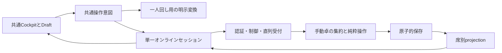

# OneDeck 共通Cockpit 統合仕様

> 2026-09-10の操作範囲: [UX仕様§6](cockpit-ux-requirements-2026-09-09.md)の採否を優先する。マナ・キーワードの操作支援を保全し、一般の効果自動判断を縮小する。従来の自動化全保全を方式選択の制約にしない。

> 要求からの再設計に伴う位置付けの変更（2026-09-09）: 本書は従来の詳細仕様・方式候補として保全する。現在の判断基準は[プロダクト要求の再設計基準](product-requirements.md#要求からの再設計基準)。§14の推奨DとA0、エンジン数、Core再利用は採用前へ戻す。Q-01は2026-09-10に部屋主の操作権回収・Kickと、部屋主不在中の停止で決定。旧制御表よりこの決定を優先し、採用方式に合わせて権限表を再構成する。Q-02は2026-09-10に脱落・終局の確定後は回復しないと決定。REQ-16/17の取消不可境界はこの決定に従い、確定前の対象・結果・取消不可の確認をUXに含める。要求の整理後に採用方式と本書の適用箇所を再確定する。

日付: 2026-09-09。状態: 要件・設計の統合案。新manual卓は未実装。本書の記述は実装済み、性能達成済み、公開済みを意味しない。

## 0. この仕様の役割

Goal: 実デッキを用いた一人回しと、通話で裁定する2人・4人対戦を、同じCockpitと操作体系で成立させる。表示だけでなく、操作、連続解決、戦闘、取消、切断復帰まで明示する。

Non-goals: 全カードの自動裁定、厳密な優先権の自動進行、通話機能、対戦のスマートフォン対応。従来ここに置いたP2P・エンジン数・全面統一・データ移行方式の除外は、技術選択を先取りするため解除し、要求を満たす候補として再評価する。既存データの無断変換/削除を許可する変更ではない。

Acceptance criteria: §17の観察可能な旅程と不変条件に対応する仕様が存在し、矛盾と重大な未定義動作が解消される。実装の合格には別途その旅程の実行が必要。

What stays untouched: 既存の未完了ソース・テスト・設定・保存データ・公開環境。今回変更するのは仕様と計画の文書だけ。commit/push/deploy、既存部屋の終了・削除は行わない。

### 文書の優先関係

- プレイヤー成果の基礎は[product-requirements](product-requirements.md)。本書は今回のユーザー回答と従来の合意を、新manual卓向けの具体的な仕様へ落とす。
- [旧設計](turn-master-cockpit-architecture-2026-09-09.md)は比較経緯・従来案の参照。本書と相違する新manual卓の設計は本書を使う。相違は§19に列挙する。
- 現行`docs/contracts/manifest.json`配下の契約は、現行実装の契約として維持する。新manual卓の仕様を実装する際、対応する条項へ適用modeを明記する。本書の作成だけで旧strict契約を改変したとは扱わない。
- [実装計画](cockpit-implementation-plan-2026-09-09.md)は順序を所有し、操作の意味は本書を参照する。モックv0.41は配置と操作体験の参照であり、正本状態や権限実装の素材ではない。

### 決定の分類

| 分類 | 内容 |
| --- | --- |
| ユーザー合意 | 共通Cockpit、通常操作マスター、HOLDによる借用、自席防御の直接確定、他席の閲覧・変更代行、現ターン内の複数undo、無料運用、操作上必要な人の切断中は停止を許容 |
| 今回のユーザー回答 | 対戦はスマホ対象外。一人回しはスマホ横画面でも使えることを希望。部屋は最終利用から6時間で失効する初期案 |
| 今回の設計判断 | サーバー適用、単一セッション所有者、manual専用の状態/操作境界、独立した防御確定の競合範囲、脱落後のターン継続、Draftと共有処理の分離。以下に一意な既定動作として記述 |
| 実測後に固定 | 履歴byte上限、配信量・遅延・無料枠の収容数、旧部屋を安全に退役できる時点。未測定の値を達成済みとしない |

## 1. 製品の範囲と完成品質

### REQ-01: 対象モード

| モード | 初回公開の扱い | 完了条件 |
| --- | --- | --- |
| PC一人回し | 必須 | 既存保存・基本操作・undo/redo・統率者演出を維持し、共通部品の改善が届く |
| PC2人対戦 | 必須 | 入室から勝敗まで同じCockpitで完遂 |
| PC4人対戦 | 必須 | 固定席、三つの相手概要、複数戦線、割込み、切断復帰、脱落後の継続 |
| スマホ横の一人回し | 希望要件 | 812×375で基本操作・保存復帰・undo・カード詳細が使えることを目指す。未達なら具体的に報告し、PC対戦の公開を無断で止める必須条件にはしない |
| スマホ縦の一人回し | 維持・退行確認 | 既存の到達可能な操作を理由なく失わせない。横向き案内が操作や復帰を覆わない |
| スマホ対戦 | 非目標 | 全操作・完全試合を保証しない。PC利用を案内する。既存部屋へのアクセスで勝手に開始・投了・退出を送らない |

UI変更時は375×812、812×375、1440×900を同じbrowser sessionで確認し、console error 0を要求する。対戦のスマホ非目標は秘密表示や壊れた復帰を許す意味ではない。表示面はPC基準で完成させ、端末判定だけで一人回しまで締め出さない。

### REQ-02: 手動卓の約束

システムは確定した操作の保存・同期・構造整合を保証する。カード効果の適用順、対象の合法性、誘発の発生、置換効果、勝敗の裁定は、明示的な対応済み支援を除き卓の参加者が判断する。

「手動」は、何もできないときの逃げ先ではない。§7の操作を組み合わせて効果を処理できることを必須にする。状態で表せない効果は未対応と表示し、注記を自動処理や再現可能な効果と偽らない。

## 2. 用語と所有者

| 用語 | 意味・所有者 |
| --- | --- |
| 席 / participant | 入室時に固定する識別。画面位置やカード名で代替しない。脱落しても席を詰めない |
| turnNumber / turnOwner | 現在のターン世代と、そのターンが始まった席。Coreのゲーム状態 |
| activePlayer | 現在のターンの有効プレイヤー。ターン途中の脱落時はnullになり得る |
| turnCoordinator | 許可・再開・ターン終了を取りまとめる席。通常はactivePlayer。脱落時だけ次の有効席へ引き継ぐ |
| master | 通常のゲーム変更を入力できる唯一の席。通常はturnCoordinator。HOLD許可中は借用者 |
| operator | 実際の入力者。認証済み接続からサーバーが束縛する |
| affectedPlayer / controller / owner | 操作対象の席、ゲーム上の制御者、所有者。operatorと独立 |
| StackEntry | カード呪文、能力、コピーの未解決実体。カード名とは別の一意ID |
| ResolutionContext | 一つのStackEntryを処理中の共有文脈。発生源・対象・進行・戻り先を保存 |
| BattleContext | 戦闘ID、段階、攻撃先、防御割当、ブロックされた事実、ダメージの確定記録 |
| WorkDraft / CastDraft | 未確定の選択・行き先・支払い準備・戻り先。端末のメモリだけに保持 |
| receipt | 操作IDと入力digestに対応する受理済み結果。取消後も保持する |

HOLDの借用でカードcontroller、ルール上の選択者、ターン所有者は変わらない。turnCoordinatorはCRの優先権保持者ではない。

## 3. 部屋の開始・終了

### REQ-03: ライフサイクル

`forming → pregame → active → finished → expired`。`suspended`はactiveの停止理由であり、別のゲームを生成しない。forming/pregameも期限失効できる。

- 新規部屋は2席または4席。4席開始後に3人へ減ってもそのまま継続する。途中参加による空席補充、席交換、3席での新規開始は初期範囲に追加しない。
- 作成者は開始前の取りまとめだけを行う。formingで各席がデッキを読み込み、`lobbyReady`（デッキ準備完了）を確定する。デッキの変更でその席のlobbyReadyを解除する。解決できないカードは名前/入力位置と安全な理由を示し、黙って欠落させない。
- `lobby.start`は作成者の明示操作。全指定席の接続・デッキ確定・lobbyReadyを必要とし、formingからpregameへ移る。二重開始は同じreceiptへ収束し、デッキ定義を固定する。ここではpregameReadyを要求しない。
- 初期lifeは既存オンラインと同じ40。初期席順・開始プレイヤー・乱数は一度確定し、復帰で引き直さない。デッキ合法性やカード対応範囲を今回勝手に拡張しない。
- pregameでは各席が自分の統率者確認、keep/mulligan、必要なbottom選択、開始前作業完了、`pregameReady`（初手等の準備完了）を行う。pregameReadyはlobbyReadyとは別の状態で、pregame進入時はfalse。ここはactiveのmaster制約の例外ではなく、pregame専用の本人権限。現在の手番と対象席を検査する。
- 既存の[Pregame型](../src/online/pregame/types.ts)・[処理](../src/online/pregame/operations.ts)・[検査](../src/online/pregame/validation.ts)の初手/マリガン意味を維持する。現行は2人/4人でbottom枚数が異なる。新方式のための再裁定は行わず、移植時に既存検査を再利用する。
- pregameの未確定bottom案は他席へ配信しない。必要な全席の完了後に、一度だけmanual active状態へ接続する。strictの偽priorityを生成して移行しない。
- pregameからmanualへの接続は、既存の初期準備結果からカード/領域/席/開始順を取り出す版付きの一回の変換。旧priority窓は新rootへコピーしない。新manualのgameRevision/acceptedCommandCountは0で開始し、roomRevisionは進める。pregameのreceiptは保持し、active操作と識別して再送を拒否/照合する。変換とlifecycle変更は原子的に保存し、復帰で再実行しない。
- 最後の有効な本人pregameReady操作を受理し、全席の必要作業完了とpregameReadyを検査した同じtransactionで、サーバーが`pregame.complete`を一度だけ確定する。外部から二度目のstartを要求するAPIは使わない。forming以外へのlobby.startは拒否（同一IDの受理済みstartはreceipt照合）。最後のpregameReadyが保存失敗ならactive化も起きない。初期乱数は準備時の確定結果を継承し、この境界で引き直さない。
- activeの「退出」は切断として扱い、投了を暗黙に送らない。投了/脱落/勝敗は§11の明示操作。脱落席は同じCockpitの公開閲覧へ移る。
- finishedでは全席が公開状態と結果を読む。ゲーム変更、HOLD、undoは終了。再戦は新部屋で行い、終了した部屋を初期化しない。

## 4. 状態とrevision

### REQ-04: サーバーにだけある正本

| 保存区分 | 内容 | 含めないもの |
| --- | --- | --- |
| room/control | lifecycle、固定席、参加状態、接続世代、master、HOLD、停止理由、期限、roomRevision | 私的Draft、画面focus |
| game | manual turn、カード/領域/数値、Stack、Resolution、Battle、公開参照、gameRevision | 認証、socket、HOLD、拡大窓 |
| definitions | 不変のカード・デッキ定義 | 画像バイナリ、各履歴への本文複製 |
| undoHistory | 取消対象の変更前可変game、対象operationId、turnNumber | 接続/制御状態、receipt、acceptedCommandCountの巻戻し |
| receipts | participant、operationId、digest、確定操作、結果revision | 公開ログへの秘密payload |

- `roomRevision`は永続的な部屋変更ごとに増える。`gameRevision`はgameの確定変更だけで増える。`gameRevision === manualRoot.acceptedCommandCount`。
- `resolution.wait/resume`はgameRevisionを進めるがundo一手を追加しない。HOLD/移譲/停止はroomRevisionだけを進める。同期確認・指示・ローカル閲覧はどちらも進めない。
- wait/resumeを含むすべての受理したgame commandでgameRevisionとacceptedCommandCountをともに1進める。undo履歴を増やすかどうかは、このcountと独立した操作の属性。重複receipt返却ではどのcountも増やさない。
- `turnCoordinator`はgameのturn/脱落状態から導出し、独立した第二のターン時計を保存しない。部屋側へ複写するなら同じtransactionで一致を検査する。
- undoも新しい確定でありrevisionは増える。古いsnapshotのrevisionやacceptedCommandCountを復元しない。
- 生のブラウザGameStateをサーバーへ送って正本を上書きするAPIは設けない。

### REQ-05: 常に守る不変条件

1. activeで有効席が残る限りmasterは一人。停止中でもmasterを消して曖昧にしない。
2. 一つの現在実体は一つの領域にだけ存在する。領域移動前の実体参照と移動後の実体を区別する。
3. 通常操作のoperatorはmaster。activeの非master例外は自席防御確定だけ。pregameの本人操作は別の受付。
4. 一つの操作IDは一つの入力に対応する。保存・乱数・演出を再送で繰り返さない。
5. 状態、receipt、必要なundo履歴を一緒に保存できなければ、操作は成功しない。
6. 古い接続、古いprojection、終了済みcontext、同名の別カードから現在の権限や実体を復活させない。
7. UIの窓を閉じる操作は、解決終了・HOLD解除・ターン進行を意味しない。

## 5. 操作権・HOLD・停止

### REQ-06: 通常の受付条件

ゲーム変更はactive、有効席、現接続世代、同期済み、停止なし、HOLDなしを要求する。通常操作はさらにmasterと最新baseRoomRevision一致が必要。防御確定だけ§9の限定された競合条件を使う。

| 操作 | 入力できる人 | 結果 |
| --- | --- | --- |
| HOLD要求 | 現master以外の有効席 | 同じturnNumber・停止なし・要求なしで一件を受理。受理直後からゲーム変更を停止 |
| 取消 | 要求者 | 対応requestIdのHOLDだけ除去 |
| 却下 | turnCoordinator兼master | 対応HOLDを除去。理由の裁定は通話 |
| 許可 | turnCoordinator兼master | 要求者が接続・同期済みならmasterを移し、HOLDを同じ確定で除去 |
| 返却 | 借用master本人 | turnCoordinatorへ返す。追加要求があれば維持。ただし要求者がturnCoordinatorなら要求も充足して除去 |
| 卓の再開 | turnCoordinator | 現coordinatorと現masterの同期確認後、切断停止を解除。HOLDが残ればゲーム変更は依然停止 |
| ターン終了 | turnCoordinator兼master | §10の条件で次ターンへ。HOLD/借用を持ち越さない |

同時HOLDは保存順で一件。後着に待ち行列を作らず「他のHOLDを確認中」と返す。HOLDだけは通常操作と競合しても同じターンなら受理でき、最新base一致を要求しない。古いターン・旧接続・脱落席の要求は拒否する。

借用中に第三者がHOLDしたら、借用者が返却しcoordinatorが次を許可する。又貸しはない。HOLDはworking/waiting/aftercare、戦闘の各段階でも要求でき、共有contextとBattleは保持する。HOLD中は解決のwait/resume/finish、防御確定、damage、undoも送れない。

### REQ-07: 切断と行き止まりを隠さない

- 部屋主と操作masterを分離する。部屋主は不在masterの操作権を明示回収でき、Kickを必要としない。旧master復帰時に旧権限や遅延入力を復活させない。
- 部屋主のみがKickできる。開始前は参加取消、試合中は不可逆の退出・脱落確定とし、対象と結果を確認する。Kickされた参加資格は再接続できない。
- 部屋主不在中は卓を停止し、所有権を移譲しない。復帰すれば同期確認後に再開できる。戻らなければ続行不能であり、勝敗の自動確定はしない。
- 部屋主がゲーム上で脱落しても管理権限は維持する。管理権限は通常の盤面操作権とは別。
- master/coordinator不在時は必要な操作を停止する。部屋主による回収は盤面上のターンや不在者の判断権の代行を意味しない。通常のHOLD/返却との接続は採用設計で具体化する。
- 回線断を検出する前にサーバーが保存した操作は有効。クリック時刻による巻戻しはしない。

## 6. 画面と作業の継続

### REQ-08: 共通Cockpit

自分の盤面と手札、固定した相手席概要、カード詳細、共有Stack/Battle、現在の操作権、停止/復帰、undoを一つの画面から扱う。独立Table画面を必須にしない。

- 相手は席順を固定。ターン変更で盤面を並べ替えない。必要な相手や発生源を強調し、詳細を閉じれば元の場所へ戻る。
- カードを読むときは拡大、処理するときは盤面と小さな発生源参照を中心にする。一操作ごとに大きなカード窓を強制再表示しない。
- 通常UIは日本語、カード名は`printedName ?? name`を《》で表示。ドラッグ/ダブルクリックには見える操作または右クリック代替を持つ。
- 送信中・確定・未適用・結果確認中を別表示。操作できない理由をボタンの近くに出す。内部revisionやschema番号を通常の対戦導線に並べない。
- 成功した意味イベントから音・motion・統率者演出を生成する。多枚数の一操作を連打音にせず、復帰snapshotで再演しない。演出は操作確定を待たせない。

### REQ-09: Draft

Draftは`editing / paused / needs-review / invalid / submitted`を持つ。source、対象のobjectIdとincarnation、元領域、行き先、順序、親context、戻り先、確定済み操作への参照を保持する。

| 事象 | 端末の結果 |
| --- | --- |
| タブ/拡大/最小化/Escape | 選択と戻り先を保持。ゲーム変更なし |
| 最新UPDATE | 実体/領域/親contextを検査。有効な選択を保持し、変わった部分はneeds-review。無効な部分だけ理由を示す |
| HOLD/借用交代/切断 | paused。勝手に提出しない。私的閲覧パネルを閉じる |
| masterを失う | 拡張閲覧データとそれ由来のカード名/参照像を破棄。Draftは秘密を含まないIDと作業構造だけ保持。再取得権が戻った後も再検査して明示再開 |
| 親contextが終了/除去された | invalid。「この処理は終了しました」。同名の別Stackへ接続しない |
| 再読込/別端末 | 私的Draftは復元しない。共有の処理文脈と確定済み結果から続ける |
| Draftを取消 | 未確定選択だけを捨てる。支払済みマナ、移動済みカードなど確定済み操作は戻さない |

手札の私的表示順はゲーム上の領域順と分離。通常hoverや秘密の対象案は配信しない。「これ」と指す明示操作だけ可視な公開IDを短命イベントで送れる。保存・undo・復帰再生はしない。

閲覧権限がある間、端末メモリのDraft/表示に現在見られるカード情報を保持できる。非公開の未確定Draftを他席へ配信せず、ブラウザ永続保存へカード名や本文を残さない。確定のためにサーバーへ送る操作入力と、他席向けの配信は別の境界である。

## 7. マニュアル操作の必要範囲

### REQ-10: 共通操作カタログ

すべて対象席/実体と行為の意味を確定操作に残す。内部の移動処理を共有しても、捨てる・破壊・生け贄を単なる移動から逆算しない。

| 操作群 | 入力・確定する結果 | 自動で行わないこと |
| --- | --- | --- |
| draw / mill / discard | 対象席、枚数または選択実体、適用先。random discardは一度決めた選択を保存 | 空山札から勝敗を自動確定、未承認の公開 |
| move / destroy / sacrifice | 複数実体、行き先、必要な順序・タップ状態、意図 | 破壊不能・置換・誘発を処理済みと推測 |
| search / scry / surveil | 見る範囲、選択、残す/下/墓地、分配と順序 | 検索条件の自動裁定、検索後の勝手な公開/shuffle |
| shuffle / random | 指定領域の順序、コイン/ダイスの結果を一度確定 | retryで引き直す、UI内だけの結果を共有確定にする |
| life / mana / counter / P-T / damage | 対象、種類、量。支払い/損失/ダメージ/訂正の意図を区別 | 数値変化だけから敗北や誘発を確定 |
| tap / untap / face / note | 対象群と状態。裏面や注記を保持 | 裏面の秘密を通常previewに出す、期限注記を自動効果にする |
| attachment / controller | 現実体同士の関係、制御者変更 | 操作代行に伴う所有者の変更 |
| token / copy | 新しい実体IDと明示した定義/状態。呪文copy、能力copy、盤面copyを区別 | 元IDの使い回し、本文だけからcopy例外を完全裁定 |
| proliferate支援 | 対象と増やすカウンターの明示選択 | 全対象へ無条件加算 |
| reveal / close reveal | 公開時の参照像、受取人、期間 | 閲覧だけで公開、以後の秘密領域追跡 |
| correction | 明示した合法なデータ構造への訂正と注記 | CR上の出来事を後付け推測して自動誘発 |

一つの複数移動や複数数値変更は一括成功/一括失敗。一要素でも不正なら全体不変。サーバーはschema、権限、対象存在、領域、有限な数値範囲、参照、一意性を検査する。現在のboundsを無制限に緩めない。

呪文の全文は一括transactionにしない。検索→公開→分配→shuffleはそれぞれ確定し、同じResolutionContextから続ける。途中でHOLDを挟めるのはその確定の間。

## 8. Cast・Stack・連続解決

### REQ-11: Castと実体

- CastDraftは対象、選択肢、支払いの準備、発生源、親contextを私的に持つ。支払い用tap/mana等を確定したら、その時点で別のundo一手になる。
- cast確定はカードをStackへ移し、新StackEntryへ対象・選択肢・controller・発生源を結び付ける。効果本文を実行しない。統率者castは確定したイベントから共通演出へ渡す。
- 能力は独自のStackEntry IDを生成し、発生源カードをStackへ移さない。コピーも別ID。発生源が消えても履歴の参照像は残す。
- 誘発候補の私的メモと、公開した能力と、解決済みを分ける。APNAP等の裁定は通話。masterが合意した順に明示投入し、自動生成と二重投入しない。
- counterは指定したpending StackEntryを解決せず除去する。カード実体の行き先を明示し、能力の発生源や支払いを戻さない。workingの実体はcounter対象にしない。

### REQ-12: 解決状態

`pending → working ⇄ waiting → aftercare → done`。後処理不要ならworkingからdoneへ。pendingの打消し/除去はremovedへ。一度に処理中のResolutionContextは一つ。

| 操作 | 前提 | 結果 |
| --- | --- | --- |
| resolution.begin | pendingの現在top、他の処理contextなし | topを処理中として予約。source/targets/returnEventを保存。カードはまだ墓地へ移さない |
| 基本操作 | workingまたはaftercare、同じcontext ID | 一操作を確定し、その文脈を保持 |
| resolution.wait | 処理中context | 会話上の待機と戻る段階を保存。waitだけでundo一手を追加しない |
| resolution.resume | waiting、masterが回答を確認 | 保存した段階へ戻す。選択や盤面を自動確定しない |
| resolution.finish | working、待機なし、入力端末に未確定の関連選択なし | 本文完了とカード行き先を一緒に確定。後処理があればaftercareへ |
| aftercare.finish | aftercare、待機なし | 文脈終了。本文終了時のカード移動を二度行わない |

waiting中も会話で必要になった基本操作は明示確定できるが、finishは不可。HOLD/停止中はそれらも不可。サーバーは他端末の未公開Draftを知っているとは扱わない。

finishの「端末に未確定選択なし」はクライアントのUX guard。サーバーの拒否条件は共有context ID・段階・共有待機・権限・版・カード参照の整合であり、私的Draftの有無を検証できるとはしない。他端末の古いDraftはfinish後にinvalidへ移る。

解決中のcastを表現できる。追加StackEntryは同じStackのpendingとして積み、`createdDuringContextId`で親を参照する。親のfinishはそのpendingを理由に拒否しない。親終了前に子の解決を始めることは拒否する。これにより「子が解決しないと親が終われず、親が終わらないと子を解決できない」循環を作らない。親終了後は通常のtop順で扱う。

共有の未完了後処理と、親の後で解決するpending呪文を同じ「子作業」と呼ばない。特殊な再帰解決を必要とし、この構造で表現できない処理は未対応と表示する。初期版へ汎用workflow engineは追加しない。

aftercareには統率者の移動選択、誘発整理、未処理の裁定メモなどを残せる。期限を自動判断して消さない。Esc/閉じる/最小化では終了しない。次のStackやphaseへ自動で進まない。

## 9. 戦闘と四人の同時操作

### REQ-13: 戦闘状態

`battle.begin → attackers → blockers → damage → ended`。Stack割込みはこの段階と直交し、同じbattleIdを保持する。damageは必要なら先制/通常を別の明示区分として記録する。

- 攻撃はattacker実体、defendingPlayer、target種別(player/planeswalker/battle)を保存。防御担当席と攻撃先実体を混同しない。
- 攻撃確定は全割当を一括で保存する。タップする実体も明示し、警戒等を未検査で自動処理しない。
- 各防御側が自分のblocker割当を確定できる。masterも同じ操作で代行可能。0件確定で「ブロックしない」を表す。
- 複数blocker、複数attackerとの関係を表現できる。型だけでブロック合法性を保証したとはしない。
- 確定済み全防御席を確認してmasterがdamageへ進める。未確認席があればその席を示し、masterが空割当を含め明示代行する。勝手に無ブロックとしない。
- blockerが消えてもwasBlockedの事実を消さない。古い実体は現在の対象に使えず、同名の新実体へ再接続しない。
- damageは対象・量・発生源・統率者由来を明示し、記録とlife等の変化を一括確定する。P/T合計や演出だけで自動適用しない。
- 戦闘終了は明示。未解決Stack、処理/待機/後処理が残る間はdamage確定・戦闘終了・防御再確定を拒否する。

### REQ-14: 無関係な防御確定を競合させない

サーバーの保存順は一つのまま。防御確定だけ、`battleId + battleGateRevision + defendingPlayerId + defenseRevision`で競合を検査する。

- `battleGateRevision`は、このBattleに影響する最後の防御確定以外の変更のroomRevision。通常のgame変更、HOLD、移譲、停止、接続世代変更、脱落、undo、戦闘段階変更で更新する。
- `defenseRevision[seat]`はその席の割当が最後に確定したrevision。別席の防御確定では変更しない。
- 本人の現接続・同期済みgate、自席、当該Battleのblockers段階、HOLD/停止/未解決Stackなし、現在の実体と制御を再検査する。
- 二人の別防御席が同時に確定しても、gateと各席の版が同じなら両方を順に保存できる。roomRevisionはそれぞれ増える。他席の割当を上書きしない。
- 同じ防御席への本人とmasterの競合は先着保存のみ成功。後着はDraft保持で再確認を求め、自動再送しない。
- 非masterの要求は防御割当一件のみ。move等を同梱した要求は全体拒否。限定権限を他席の私的閲覧権へ拡張しない。

この版管理は四人の必要な並行入力だけのために設ける。すべての操作への部分merge、CRDT、汎用競合エンジンへ広げない。

## 10. ターンと取消

### REQ-15: 手動ターン

manual turnはturnNumber、turnOwner、activePlayer、positionを持ち、strict priority holder/passed sequenceを持たない。phase表示は既存のフェイズ/ステップ名を使うが、自動passを生成しない。

phase変更・ターン終了には、HOLD/停止なし、coordinator兼master、Stack/処理文脈の完了、必要なBattle終了を要求する。通常のphase変更自体はゲーム操作で、undo対象。turnNumberはターン終了確定時だけ増える。

activePlayerがnullでも、現masterは残るターンの基本操作/解決を行え、coordinator兼masterはphase変更・明示的な`turn.end`を確定できる。nullだけを理由に操作不能にしない。`turn.end`は固定席順で現在のturnOwnerの次に残る有効席を選び、turnNumberを1進め、その席をturnOwner/activePlayer/coordinator/masterに設定する。借用、HOLD、取消履歴を持ち越さず、開始positionへ移す。脱落者を飛ばすことは、残るプレイヤーのターンを一つ飛ばすことではない。

manualのphase/turn変更だけでdraw、untap、マナ消去、cleanupを黙って実行しない。それらは明示した共通操作で行う。既存一人回しの自動進行はそのモードの動作として維持し、onlineへ暗黙移植しない。

### REQ-16: 卓全体のundo

- 現ターンの確定操作を、新しい順に一件ずつ現masterが戻す。実行者が別の防御席でも同じ履歴に入る。
- 一つの複数移動は一手。検索→公開→分配→shuffleは四つの明示確定。Draft取消、閲覧、HOLD、接続、wait/resumeはundo一手を増やさない。
- サーバーは指定された履歴topのoperationIdを照合し、保存したbeforeGameの可変状態を復元する。新しいgameRevision/acceptedCommandCountを付け、現在の認証・master/HOLD・接続・receiptを維持する。
- undoそのものを新しい取消対象へ積まない。元operationIdの再送は元receiptを返し、取り消した盤面変化を再実行しない。onlineにredoは作らない。
- 同じcontext IDが復元後にもある場合、現在の会話待ちを維持する。beginを取り消したらcontextと待機は消える。finishを取り消してcontextが戻る場合は変更前の処理段階へ戻す。
- 公開のundoは表示中の参照を戻せるが、人が見た知識を戻したとは表示しない。
- 次ターン、脱落、終了は取消境界。確定前に対象と「ここより前へ戻せなくなる」を表示する。通常の閲覧や移譲は境界にしない。
- 初期測定候補は200件。byte上限は実デッキで固定する。古い履歴を容量で落とす場合は保持件数/最古の取消可能位置を表示。最新操作の履歴を保存できない場合、その操作全体を拒否する。

## 11. 脱落と勝敗

### REQ-17: 脱落でターンを飛ばさない

現masterが通話で確認した脱落・投了・勝敗を明示確定する。非master本人が投了したい場合はHOLDして伝え、masterが確定する。単なる切断とは区別する。不在masterの操作権回収と部屋主のKickはREQ-07に従い、単なる切断から投了を推測しない。

- 脱落の確定は取消境界。所有物・制御関係・Stack/Battle・公開参照・待機相手を整合させた一つの結果を保存する。単なる席の非表示にしない。
- 既存の[脱落処理](../src/engine/core/player-lifecycle/playerExitReconciliationV1.ts)の再利用は、固定版[CR](../rule/Magic_The_Gathering_Comprehensive_Rules.txt)800.4a–kに対する対象範囲を直接確認する。対象範囲を表せない場合は確定前に手動後処理を明示し、部分適用を成功扱いしない。
- turnOwnerが脱落してもそのturnNumber/positionを維持し、activePlayerをnullにする。CR 800.4jに従い、残るターンを勝手に終わらせない。次の有効席をturnCoordinatorとし、masterもそこへ返す。別の人への借用とHOLDはこの境界で解除する。
- turnOwner以外の借用masterが脱落したらcoordinatorへ返却。その他の脱落では有効なmasterを維持。脱落者のHOLDは取消す。
- 進行中Battle/Resolutionは、生存する実体と文脈を保持する。脱落で処理対象そのものが消えた場合は終了理由を記録して閉じる。待機相手が脱落した場合、回答済みにせず「選択者の再指定が必要」とし、masterが通話の裁定を明示する。
- 発生源カードが領域を離れたことだけで能力や処理文脈を閉じない。「処理対象が消えた」は脱落処理で当該StackEntry自体が除去される場合等を指す。発生源の参照像と現在の実体は別に扱う。
- 脱落席の拡張閲覧・手札表示・操作権は失効し、公開projectionだけへ切り替える。旧タブやundoで復活させない。
- 最後の有効席だけになった場合も、勝敗確定を同じ明示操作の結果として保存する。全員が同時に脱落する結果は引分けとして扱える。終了結果のプレビューで残る席/結果を示す。
- finishedは切断停止より優先し、停止解除や復帰を勝敗確定の後に要求しない。ゲーム変更・undoは受け付けない。

## 12. 閲覧・公開・秘密

### REQ-18: 表示入力を分離する

| 入力 | 受取先 | 内容 |
| --- | --- | --- |
| publicProjection | 許可された参加者/脱落席 | 公開盤面・公開Stack/Battle・枚数・公開イベント |
| selfPrivateProjection | 有効な本人席 | 自分の手札等。秘密の山札順序を通常画面へ混ぜない |
| masterPrivateProjection | 現masterの有効接続のみ、HOLD/停止なし | 全席の閲覧・変更代行に必要な非公開領域。通常表示とは別のデータ領域 |
| directedReveal | 明示した受取席 | 公開時点の参照像。その他の席には非配信 |

grantの確定snapshotには新master用データを含められるが、ゲーム操作はそのsnapshotの同期確認後だけ。旧masterへは通常projectionを送り、拡張データ・閲覧由来のDraft内容を破棄する。HOLD/停止/切断/脱落/終了でも同様に失効させる。再開後もパネルは勝手に開かない。

masterによる「見る」は選んだ席/領域をヘッダに示すローカル表示。所有者への追加承認は不要。閲覧だけでrevision/undoは増えない。自分の手札は非masterでも見られる。

公開は別の共有操作。参照像、受取席、causeContext、終了条件を保存する。結び付いたResolutionContextの完了または明示終了まで保持し、次の盤面変更だけで消さない。移動後の秘密領域を追跡するライブ参照にはしない。

master端末に渡った情報を開発者ツールから撤回できることは保証しない。ただし通常の検索・preview・履歴・演出・エラーで漏らさない。秘密payload、認証、部屋/招待識別子を公開ログや証拠へ出さない。

## 13. 接続・確定・復帰

### REQ-19: セッションの所有者は一つ

対戦中の一席に有効な操作WebSocketは一つ。HTTPは初回入室等の補助に限定し、HTTP/poll/WSが別々に再試行しない。通常の盤面ポーリングは設けない。

二つ目の同席タブは「別の画面で参加中」を示し、初期版では自席の追加購読接続を作らない。「この画面で再開」を明示すると接続世代を更新し、旧接続を無効化する。最新snapshotを取得してから操作可能にする。自動で接続を奪わない。

端末は送信中操作一件まで。送信前に操作IDと入力digestだけを安全なpending記録へ保存し、実payloadはメモリに置く。記録失敗なら送信しない。再読込後はIDで結果照合し、失ったpayloadを推測しない。

### REQ-20: wire上の意味

| 要求/通知 | 必須の意味 |
| --- | --- |
| hello / takeover | 席認証、対応版、現接続世代。serverがoperatorを決定 |
| mutate | operationId、入力、通常baseまたは防御用precondition。生snapshot不可 |
| hold | operationId、turnNumber。現在のmaster以外、同一ターンの一要求 |
| grant/rejectHold/cancelHold/return/resume | operationId、baseRoomRevision、該当requestId/役割 |
| sync | 最新snapshotと指定operationIdのreceiptを同じ読取り時点で返す |
| synced | 採用済みrevisionを接続へ記録。永続revisionを進めない |
| update | 保存済みrevision、席別snapshot、必要な確定イベント/結果ID |
| reject | 未適用を意味する安全なcode、現在revision、再同期要否 |
| snapshot | 入室/復帰の確定状態。通常演出を再生しない |

受理順序: 形式/サイズ/認証 → receiptの重複照合 → 新規適用なら現接続/権限/precondition → 純粋適用 → 状態+receipt+undoを原子的保存 → 各socketへ独立配信。

認証済み本人は権限を失った後も自分のreceiptを照合できる。旧世代から新規適用は不可。同じIDと異なる入力は拒否。digestは認証秘密や接続世代を含めず、操作の入力と元preconditionを正規化したものに束縛する。

### REQ-21: 障害時の結果

| 障害 | 結果 |
| --- | --- |
| 保存前の失敗 | 操作未適用。candidateを捨て、成功イベントなし |
| 保存後に操作者への送信失敗 | 状態は確定済み。他席配信を中断せず、本人はreceiptで確認 |
| 応答不明 | pendingを確認中にし、新しいゲーム操作を止める。新IDで盲目的に再送しない |
| syncにreceiptなし | 新接続世代で旧入力を無効化した後、同じ直列受付でreceiptを再照合。そこでもなければ未適用と確定。古い要求が後から実行されない |
| 同じpayloadを再提出する場合 | 未適用の確認後、最新画面でユーザーが明示。新操作として扱う。確定済みreceiptは再適用しない |
| サーバー再起動 | snapshot・control・receipt・undoから復元。新規盤面や通常の全履歴再生で代用しない |
| 旧UPDATE/旧callback | revisionと接続世代で破棄。dispose後はsocket、poll、storage書込み、通知を復活させない |
| 版不一致 | 互換性エラー。更新を止め、再読込/対応版への入口を示す。保存を自動変換しない |
| 保存/プラットフォーム上限 | 成功を装わず停止。読取り可能なら既存状態を表示。サービス自体が利用不能なら復帰待ちを表示 |

最初の接続も無期限に待たない。初期測定値は一試行15秒、再接続全体30秒で手動再試行へ。1秒で確認中、10秒で結果照合を案内する。これらは失敗/未適用の証明ではない。ゲーム進行や権限移譲の時間切れには使わない。

## 14. 実装アーキテクチャの選択

> 2026-09-10の比較結果は[共通中核への段階統合案](cockpit-architecture-comparison-2026-09-10.md)。以下の旧D案より同書の比較と実証条件を優先する。新比較のCは旧表のCとは別の分類である。方式の最終採用は未実施。

### DES-01: 従来のアーキテクチャ候補（要求再整理後に再判定）

2026-09-09、ユーザーから「本当に今の計画でいいのか」と再評価を要求された。従来の「既存Coreへmanual分岐を加える」という粒度では実装開始に不十分。共有画面、共有操作意味、共有状態モデル、共有実装を分け、再利用境界と移行費用をここで定義し直す。過去のHIGH/BLOCKER 0は仕様内の矛盾についての判定であり、最適なアーキテクチャの証明ではない。

以下は従来の推奨 **既存Coreから卓上の値と純粋操作を切り出し、その上に手動卓の集約を作る部分再構築** の具体像として残す。最新のユーザー依頼により、共通中核への全面統合を含めた再比較前の候補へ戻した。本文の「採用」「非目標」はこの候補内部の方針であり、他候補を排除する製品要求ではない。A0もこの候補用の旧実証案であって、現時点の着手指示ではない。

サーバーが操作適用・順序・保存を所有する。ブラウザmasterは操作権を持つだけで、計算ホストではない。固定ブラウザホスト方式は採用しない。

#### 層と依存方向

| 境界 | 所有するもの | 所有しないもの |
| --- | --- | --- |
| 卓上の値・純粋操作 | カード定義、物理カード/実体識別、領域、runtime、不変更新 | active player、priority、master、認証、保存、React |
| 手動卓の集約 | manual turn、盤面、Stack、Resolution、Battle、公開参照の同時整合、意味イベント | socket、DB、私的Draft、支払いや誘発の推測 |
| 部屋の処理 | 認証、接続世代、master/HOLD、操作の直列受付、revision、undo方針 | ゲーム効果を独自に再実装すること |
| repository | 版付きsnapshot、receipt、undo、controlの原子的保存と読取り | ゲーム進行を再裁定すること |
| projector | 確定状態からpublic/self/master/限定公開を生成 | カード移動や状態修復 |
| session | 接続、pending照合、同期、takeover、dispose | 別のゲーム正本、効果適用 |
| Cockpit | 表示モデル、利用可能操作、Draft、確定イベントの演出 | 完全GameStateを前提とした隠れた裁定 |

ゲーム操作と制御操作は同じ直列受付へ入り、一回の確定で必要な保存をまとめる。部屋/ゲームを別サービスや別DBへ分けない。抽象基底クラス、plugin registry、汎用workflow engineは不要。上表は責任境界であって七つの新framework/パッケージを作る指示ではない。

手動卓の適用は概念上`applyManual(state, resolvedCommand) → accepted(nextState, events) | rejected(reason)`。乱数結果はcommandへ固定済み。認証秘密と接続世代は渡さず、対象席は明示する。部屋が認証/操作権を検査し、適用側が対象存在・参照・状態遷移を検査する。拒否時は入力状態不変。

新manual状態は盤面とmanual進行を直接持ち、strict rootの`ruleAuthority.turnPriorityBundle`を内包しない。旧strict root/commandと新manual state/commandを、部屋の版識別で分ける。strict canonical validatorの引数へmanual unionを無差別に広げない。

#### 現Coreのどこを切るか

[object registry](../src/engine/core/object/objectRegistryStateV2.ts)は`activePlayerId: CorePlayerId`を持ち、[registry validator](../src/engine/core/object/objectRegistryValidationV2.ts)は旧identity/zone形へ投影して検査する。rootだけmanualにしてもactivePlayer=nullを表現できない。新しい卓上状態の不変条件からactive playerを分離し、旧strict入口でだけ従来のactive player条件を付加する。既存registry V2のそのままの再利用を採用条件にしない。

物理カードID、incarnation、カード定義、領域の一意性、カウンター等の値と検査は残す。現[tabletop operations](../src/engine/core/tabletop/operationsV1.ts)のdraw/tapはrootを受け取り`rebuildRoot`まで実行するため、関数全体のimportは再利用にならない。カード/領域/runtimeを受け返す更新部分を抽出し、旧strict操作も抽出した同じ処理へ委譲する。manualだけにコピーして元処理を残す形は避ける。

移動時のincarnation変更、添付参照の整理などの構造整合と、priority/visibility grant/strict lifecycleの整理を分ける。後者はstrict側に残す。新manualの公開参照やwasBlockedの保存を、旧rootの自動整理に委ねない。

新しい手動集約は旧onlineの置換先であり、第三の恒久的な対戦経路にはしない。ただし「第三エンジン禁止」を理由に旧rootへ無理に押し込まない。旧strictのコードがCR検査用に残ることと、製品に三つの盤面正本があることは別である。

#### 表示の境界を作り直す

現[projectionToGameState](../src/components/online/remoteGameScreen.tsx)はremote projectionからsoloの`GameState`を構築し、pendingTriggersやeventLogなどへ空配列を補っている。これは読み取り用でもsolo状態の形を共通UIへ強制する結合である。

新Cockpitは必要な表示だけを持つ読み取り専用の`CockpitView`を受け取る。local snapshot→view、remote projection→viewの一方向変換にする。viewをengineへ書き戻すAPIはない。既存カード/領域/詳細部品を順にこの入力へ移し、remote→擬似solo GameState変換を最後に撤去する。画面全体を二つ作らない。

操作は「draw、move、cast、resolve」の意味、対象、結果を共有し、Local/Remoteの具体的な送信口を持つ。表示専用操作とゲーム変更を同じ巨大portへ詰め続けない。機能の可否は利用可能操作と理由で明示し、空関数/nullを成功の代わりにしない。

#### 一人回しとの共有範囲と残る負債

初期公開時には、一人回しの既存GameState/applyCommandと、新onlineのmanual集約の二つの適用系が残る。**表示を共通化しても操作実装が自動的に一つになるわけではない。** 残る二系統は意図的な費用として扱う。

Local変換は対象席/実体を明示して既存commandへ変換する。共通の手動操作で、片側だけ自動誘発/cleanup/支払いを追加することを許さない。自動支援を使う一人回しの操作は別の能力として表示し、手動操作と混同しない。変換できない共通操作をsilent no-opにせず、その操作の再設計/小さな純粋処理抽出を必要な範囲で行う。

既存[互換catalog](../src/engine/compatibility/soloCoreCompatibilityV1.ts)はstack等をlossy、full combatやpending trigger進行をunsupportedと分類している。これは現在の変換範囲の根拠であり、新設計での不可能性の証明ではない。全状態の相互変換・双方向同期は採用しない。

共通操作を追加するたび、両モードの同じ意図に対する観察結果を照合する。一致対象はカード所在/数値/対象/意味イベント/取消境界であり、非公開情報の内部配信、onlineにないredo、自動裁定の全機能まで一致させない。新しい巨大な全カードparity suiteは作らない。

完全な一エンジン化は、既存一人回しの自動化と保存を新中核へ移す別の大きな投資になる。今回は必須にしない。この二系統の維持費が小さいと実測せず主張もしない。

### DES-02: 比較・採用条件・撤退条件

| 案 | 得られるもの | 具体的な費用/弱点 | 判定 |
| --- | --- | --- | --- |
| A 現onlineの局所修正 | 小さい初手 | owner/priority、root、registry、protocol/saveの前提が残る。今回の仕様を受付変更だけでは満たさない | 不採用 |
| B strict Core全体へmanual unionを追加 | 既存の型名/入口を多く残せる | registryより上のvalidator、projection、保存、呼出元へmode分岐が伝播。見かけの再利用で変更範囲を隠す | 現案のままでは不採用 |
| C 既存solo engineをサーバー正本へ昇格 | 一人回しの操作資産に近い | localPlayerIdと平坦な互換状態の前提、明示対象/自動処理/隠れた情報の境界を再検査。現Coreの認証以外のprotocol/保存/projectorも適合が必要 | 有力な対案だが今回は非推奨。純粋関数であることだけでは勝たない |
| D Coreから卓上処理を抽出しmanual集約を再構築 | 進行/通信の前提を値と操作から外せる。旧onlineを退役できる | 抽出とstrict回帰検査、専用projection/repository、local変換の費用。二系統の適用系は残る | 推奨。A0の実証を条件にする |
| E 全モードの状態/適用を全面再構築 | 最終的に一モデル/一適用系へ揃えられる可能性 | solo自動化、保存、選択、全UIの移行まで必要。移行費用と以後の重複削減の両方を比較する | 再比較対象。規模だけで投資過大と判定しない。要求から描く構造との適合で判断 |

費用はソース依存からの定性的比較であり、実装日数やベンチマークではない。C/Dの優劣を決める主要因は、CPU実行場所より「手動の一操作を旧進行やviewer identityから独立させる量」と「保存/UIまでの移行量」。サーバー適用を選ぶこととCoreを選ぶことを別の判断にする。

Cの根拠は[local commands](../src/engine/commands.ts)のlocalPlayerId既定値と、[gameStore](../src/store/gameStore.ts)にあるhistory・guided/cast/解決途中状態。純粋engineが認証やreceiptを持たないこと自体は正しい設計であり、欠点とはしない。問題は既存UI/storeに置かれた必要な処理文脈を、復帰可能な正本へ移す費用である。既存一人回しを「一人専用で多人数に使えない」と断定する根拠にも使わない。

#### A0: 大きな接続実装の前に境界を実証する

J1へ全投資する前に、同じ小さな代表状態で次の四点を確認する。新framework、全カード対応、公開は不要。今回は設計のみでありA0自体はまだ実施していない。

1. **他席への移動と取消**: incarnation・所在・添付参照を保つ一つの純粋処理を、strict入口と新manual入口の双方が使える。fake priority、rootコピー、状態全体の往復変換なし。
2. **脱落したターン所有者**: activePlayer=nullのmanual状態で残ターンの操作とturn.endが成立する。旧registryのactive player前提を新状態へ密輸入しない。
3. **Cast→連続解決の表示**: local/remoteから同じ必要最小限のCockpitViewへ入力でき、source/targets/処理中文脈が空配列や偽GameStateなしで表示される。共通手動操作の意味を両入口で照合する。
4. **保存済み・応答不明**: 新snapshot+receipt+undoの保存と復元をローカル実storage境界で通す。旧ProtocolStateの丸ごとJSONや全履歴再生へ戻らず、room/gameRevisionを分離できる。

四点に対して、使った既存処理、置換する呼出元、残った変換、実行結果を一枚の比較記録にする。A0の完了は「D採用」「Cへ変更」「より大きな中核再構築が必要」のどれかを根拠付きで決めること。未達のままJ1へ進まず、同じ候補へ無制限にpatchを積まない。

Dから撤退する条件: 代表操作ですらstrict lifecycleを複製しないと使えない、抽出のためsolo自動化全域の再実装が必要、共通手動操作をLocal変換で保てない、または新保存が旧protocolへ再依存する場合。Cを再検討する際は同じ四点で比較し、二候補とも不成立なら範囲/移行設計を再決定する。都合の悪い要件を削って合格にしない。

#### 実行順序の補正

`A0境界実証 → J1の実通信 → 共通Cockpit/solo接続 → 複雑な操作 → 四人戦闘 → 一試合 → 公開/退役`。新機能を作る前に、ゲームモデルと表示モデルの境界を一度通す。A0の結果によって工期を再見積もりする。現時点で日数は確約しない。

既存の[protocol state](../src/online/protocol/variable.ts)はCore rootとreceipt配列を持ち、revision=countを要求する。[repository](../src/online/cloudflare/persistence.ts)のcommitVariableAcceptedV2はその全体JSONを比較/保存する。従って新manualのrepository/projectorは旧型へのadapter追加だけで済むと見積もらない。既存の認証・デッキ解決・transaction手段は再利用候補だが、旧保存集約は版付きで置き換える。

保存は最新snapshotを正本にし、receiptを重複排除、undoを取消に使う。receipt/journalを第二の実行正本にせず、通常の操作や復帰で全履歴をreplayしない。履歴からの検証機能は既存契約の範囲で別扱いとする。全snapshot配信は第一候補だが、容量目標未達なら不変定義の重複配信から改善し、即座にCRDTや差分frameworkを導入しない。

### 現コードから確認した根拠

- [tabletop server](../src/online/tabletopManual/server.ts): actor/priority/windowと操作受付が結合。
- [tabletop operations](../src/engine/core/tabletop/operationsV1.ts): registry変更後にrule authorityとstrict rootを再構築。
- [root](../src/engine/core/closure/rootV1.ts)・[validation](../src/engine/core/closure/rootValidationV1.ts): 現rootはruleAuthorityを必須とする。
- [共有undo](../src/online/protocol/variableCommand.ts): 現経路はsharedCheckpointとrevision関係を使う。新ターン内履歴をそのまま代入できない。
- [remote port](../src/components/online/remoteGameScreen.tsx): 統率者cueとtransitionCueがnull。同じGameScreenの使用だけでは演出を継承しない。
- [保存](../src/online/cloudflare/persistence.ts)・[runtime](../src/online/cloudflare/runtime.ts): 保存/受付/配信の既存素材はあるが、新command/receipt/直接snapshot配信の実装証拠にはならない。

## 15. 保存期間と無料運用

### REQ-22: 六時間で失効

初期仕様は新部屋について最終利用から6時間。旧案の「終了後24時間」は採用せず、終了した部屋も同じ6時間を初期値とする。既存部屋へ遡及しない。

- 最終利用は認証済み参加者による明示的な部屋への復帰、ゲーム/制御操作の受理。ただし部屋主不在中は他席による期限更新を行わず、部屋主本人の有効な復帰で更新を再開する。ping、自動再接続、自動sync、閲覧だけの長時間接続は更新しない。試合開始から6時間という上限ではない。
- `expiresAt`をサーバー時刻で保存し、入室時と部屋メニューに期限を表示する。利用延長も同じ保存の確定後に反映する。
- 期限を過ぎた部屋は新規の復帰・操作・延長を受け付けない。開きっぱなしのsocketも期限を免除しない。直前に操作が確定して期限が延びた場合は、削除時に最新版を再検査して保持する。
- 新設した保存領域だけを期限処理の対象にする。期限判定とデータ削除は分離し、alarmが遅れてもアクセスを拒否する。削除時に古い期限を根拠に最新データを消さない。
- 失効画面から新しい部屋を作成できるが、消えた試合を復元したとは表示しない。最終利用の具体的な定義と期限失効は入室画面で説明する。

### DES-03: 保存・費用の構成

最新snapshot、control、immutable定義、receipt、undoを分けて保存する。小さなcontrol変更で毎回全gameを再保存しない。receiptは部屋の寿命中保持し、通常復帰で全receiptをクライアントへ渡さない。

Cloudflare SQLite Durable ObjectsのtransactionとHibernation WebSocketを使用する設計。強い整合性と原子的保存の手段は[公式storage資料](https://developers.cloudflare.com/durable-objects/api/sqlite-storage-api/)、休止対応は[公式WebSocket資料](https://developers.cloudflare.com/durable-objects/best-practices/websockets/)を2026-09-09に確認。採用できる機能の確認であり、このアプリでの正しい接続を証明したものではない。

[公式料金資料](https://developers.cloudflare.com/durable-objects/platform/pricing/)を同日確認。無料の実アカウント設定は未確認。無料で無制限の対戦を保証しない。自動有料化はしない。

測定入力は4人×100枚、1,000代表操作、4時間相当、10試合/日を仮の負荷とする。実測保存行数×操作数、receipt/undoを含むbytes、席別配信量、CPU、通常/休止復帰の遅延を記録する。10試合/日はユーザーの保証要求ではなく容量判断の仮値。

初期測定候補は可変snapshot 1 MiB、受理操作10,000件/部屋、undo200件。製品の確定上限には実測と明示表示を要する。容量限界まで通常操作で使い切って返却/停止等も保存できなくする設計は不可。制御用余裕を確保し、無料枠停止を自動retryで悪化させない。

仮の性能採用目標: 通常操作→他席の確定表示p95 500ms以下、休止復帰の最初の操作p95 1.5秒以下、通信回復後snapshot反映5秒以内。ネットワーク条件・標本数を明記し、未達の原因を計算/保存/配信/描画へ分ける。数値達成を人の理解の証明にしない。

## 16. 切替と負債の退役

### REQ-23: 新旧を永久に抱えない

新部屋には保存schema・operationVersionを持たせ、旧strict部屋のsnapshotへ新manual commandを適用しない。旧部屋は移行せず、公開切替時に既存利用状況と旧版の継続可能期間を確認する。旧部屋の終了/削除時期はここで勝手に決定しない。

公開は対象SHA・互換Worker・frontendの順序を固定し、現行CIの`check:release`を通す。旧frontend/新Worker、新frontend/旧Worker、同版復帰、非互換の安全な拒否を確認する。新schemaを旧Workerへ戻して読ませない。

各実装段階で置換した責任と退役条件を記録する。最後に次を満たす。

- 一つの席の接続/再試行/disposeを複数controllerが所有しない。
- 同じターン/Stack/Battleを独立した二つの状態で更新しない。
- manual操作のために偽priorityや全員passを作らない。
- 比較用の第二入口、不要な変換、debug処理を残さない。
- 同じ見た目のために操作・カード部品・演出をモード別にコピーしない。

既存データと稼働中部屋の保護を満たすまで旧経路を撤去しない。撤去できない理由・期限・残る責任を具体化し、単に「互換性のため」として無期限に残さない。

## 17. 受け入れ旅程

以下は必要な証拠の仕様であり、新規test件数の要求ではない。既存検査へ対応付け、欠ける現在のbehaviorだけを小さく補う。

| ID | 実画面から行う旅程 | 合格時に観察すること |
| --- | --- | --- |
| J1 核心の卓 | 独立二席、実デッキ、初手→カードcast→相手HOLD→許可→応答→手動解決→一手undo→切断/復帰→次の一操作 | 同じ公開事実とrevisionへ収束。支払いとDraft取消を混同せず、共有source/contextを保つ。新構造の採用境界を決定 |
| J2 複雑な一手 | sourceから検索→複数選択→限定公開→手札/タップ戦場へ分配→shuffle→数値変更→本文/後処理終了 | 各操作が別確定。有効な選択を維持。公開参照と秘密領域を追跡混同せず、途中undo/移譲後も続けられる |
| J3 四人戦闘 | 三戦線→異なる防御席の同時確定→同じ席の本人/代行競合→Stack割込み→HOLD→同じBattleへ復帰→damage/終了 | 別席二件とも保存。同席は一件だけ保存。複数blockerと消失後のwasBlockedを維持 |
| J4 一試合 | 二席入室から開始、keep/mulligan、少なくとも一度のターン交代、Stack/HOLD/解決、割込みを伴う戦闘、復帰後の確定操作、脱落/勝敗 | 開発者コンソールや直接state注入なしで終了。finishedは同じCockpitで公開閲覧。J1成功だけで完全試合と呼ばない |
| J5 四人継続 | 四席開始、少なくとも二回のターン交代、J3、turnOwnerの途中脱落、残るターン処理、次の有効席のターンで一操作 | 席を詰めず、脱落直後にターンを飛ばさない。私的権限失効。残る三人で継続 |
| F1 保存と通信 | 保存前失敗→状態不変、保存後応答消失→receipt照合→復帰、旧接続の遅延入力/UPDATE→dispose | 一操作が0回または1回だけ適用。保存済みを未適用と誤認しない。退出後のsocket/poll/storage/callback再発なし |
| S1 一人回し | 既存保存を開く→基本操作→undo/redo→統率者cast→保存/復帰 | 既存の意味と演出を維持。横スマホの希望要件の到達点を別記 |

本番完了の判定には許可された公開版のJ4/J5を必要とする。ローカルWorker実通信、通常テスト、公開版ブラウザ、人の観察は別の証拠。人間観察Cは既にdeferredであり、今回新たな必須ゲートに戻さない。機械検査で「人が迷わず遊べた」とは主張しない。

既存証拠の接続先: [tabletop server検査](../src/online/tabletopManual/__tests__/serverV1.test.ts)、[runtime検査](../src/online/cloudflare/__tests__/tabletopRuntimeV1.test.ts)、[共有undo検査](../src/online/protocol/__tests__/sharedUndoV2.test.ts)、[Pregame検査](../src/online/pregame/__tests__/pregameLifecycleV1.test.ts)、[一人回し保全](../src/store/__tests__/soloPreservation.contract.test.ts)、[既存旅程driver](../scripts/online/o4p-09i-full-match-evidence.ts)。これらが現在新manual仕様を証明しているとは扱わない。

## 18. 仕様の完了と残る判断

要件の分類、受付条件、状態所有者、正常/障害結果、画面継続、保存・失効、受入旅程がそろい、別文脈レビューのHIGH/BLOCKERが解消した段階で、実装の基準となる仕様案として完成とする。設計レビューは実装採用の実証や出荷の代替ではない。

実装時に残す判断は、(1) A0での純粋操作・表示・保存境界と推奨Dの採用、(2) 実測による保存byte/操作上限と無料容量、(3) 既存部屋の状況に応じた安全な公開切替・退役日程。A0を通過するまでJ1へ進めない。独立した準備作業は継続できる。

### 実装開始時に反映する現契約の差分

| 現契約 | 新manualに必要な区別 |
| --- | --- |
| [turn-priority-and-stack](contracts/engine/turn-priority-and-stack.md) | strictの自動進行とmanualの明示進行。activePlayer不在の残ターンとcoordinatorを別にする |
| [commands-and-transactions](contracts/engine/commands-and-transactions.md) | 一操作の原子性を維持し、呪文全文と一操作を区別。版付きmanual commandとターン内undo |
| [state-and-invariants](contracts/engine/state-and-invariants.md) | manual rootの不変条件、共有context、単調countと復元する盤面の区別 |
| [responsive](contracts/ui/responsive.md) | 共通の三viewport検査は維持し、対戦全操作のスマホ到達性は対象外と明記 |
| [audio-visual](contracts/ui/audio-visual.md) | local/remote共通の確定イベントから演出を生成。snapshot取得で再演しない |

この対応表は今回の仕様の適用先を示す。既存の検査を弱めたり、旧部屋の契約へmanualを無条件適用したりしない。

## 19. 従来案との相違

| 従来案/不足 | この仕様 |
| --- | --- |
| 共通UIの三viewportと対戦完成範囲が混在 | PC対戦必須、スマホ対戦対象外、横スマホ一人回しは希望要件 |
| 旧7日案/終了24時間案 | 2026-09-10に最終利用から6時間へ変更。終了した部屋も同じ期限 |
| turnPlayer脱落で即次ターン | turnOwner/activePlayer/coordinatorを区別し、残るターンを継続 |
| 異なる防御席も全roomRevisionで競合 | 防御だけgate+自席版で比較し、別席同時確定を許可 |
| 解決中castと未完了子作業の区別が曖昧 | 親終了後に解決するpendingは親finishを妨げない |
| 二つ目の同席タブへ常時追加配信 | 初期版は追加購読なし、明示takeoverのみ |
| master拡張情報とDraft保持の衝突 | 権限失効時は秘密の内容を破棄、作業構造/IDだけ保留 |
| 基本操作同期を最初の接続完成にする | J1でHOLD/応答/手動解決/undo/復帰まで縦につなぐ |
| Coreへmanual分岐を足しJ1で再利用を判断 | §14で五案を比較。卓上処理抽出・表示境界・保存集約の部分再構築を推奨し、J1より前のA0で実証する |
| 共通画面を共通操作実装と同一視し得る | CockpitView/操作意図/適用系を区別。二つの適用系の維持費と意味照合を明示 |

## 20. 今回の検証記録

2026-09-09、別文脈の`spec_gap_review`が本書を読み取り専用でレビュー。wait/resumeとcountの関係、activePlayer不在の操作、pregame→activeの原子的な接続、finishのUX guard、権限のあるメモリと永続保存の区別を補正した。追加のlobbyReady/pregameReady混同も解消し、最終の対象箇所再確認で残るHIGH/BLOCKERは0。

`npm run check:docs`はPASS。新仕様の23個の要件ID、3個の設計判断ID、変更文書のローカルリンクとコードフェンスを確認した。実装・ゲームテスト・browser旅程・負荷測定・公開は今回実施していない。過去の設計レビューや既存テストを新manual方式の実装証拠へ流用しない。

同日の追加アーキテクチャ再評価: `architecture_challenge`がlocal engine/store、Core、remote表示変換、protocol/保存を別文脈で確認し、改訂§14をレビュー。残るHIGH/BLOCKERは0、推奨DはA0の実証を条件とするとの判定。A0/J1は未実施であり、性能・抽出工数・最終採用の実証はない。要件の矛盾解消とアーキテクチャの比較を区別して記録する。
